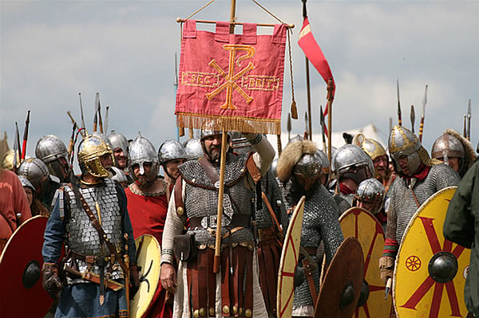

The first thing I think of when I hear banner is something like this:

However, I don't think I've ever thought of it's utility in a roleplaying game before. Banners, standards, and flags were used to mark the position of various groups of troops on the battlefield and allowed the general officers in the back to get a glimpse at what was happening. I've not run a full-scale battle like this in an RPG and generally shy away from it, but I could see it's use in a smaller game where there were a number of hirelings and one could carry a standard. But what would it do? I imagine it would be good for morale of the group, but wouldn't negatively affect the other group's morale. It could also be used as an improvised weapon, but isn't really made for that and probably breaks easily enough. Also, if it is good for morale, it would draw _certain_ enemies to destroy it. That feels like enough of a start for an item (for B/X Dungeons & Dragons and maybe more specifically [Old-School Essentials](https://necroticgnome.com/collections/old-school-essentials))...

## Battle Standard

Rallies the rest of the group to battle.

- **Morale Boost**: Once per day each player can re-roll a failed roll if they're within 30' of the standard and can see it. They must accept the second roll.
- **Improvised Weapon**: The standard can be used as a Blunt, Melee, Slow, Two-handed weapon and does **d8** damage. However, every strike there's a 10% chance of the standard breaking.
- **Sitting Duck**: Intelligent enemies know the value of a battle standard and will attempt to attack the person holding the standard. Unintelligent enemies do not treat the standard bearer any differently than any other character.

Side note: the [Old-School Essentials: Advanced Fantasy Kickstarter](https://www.kickstarter.com/projects/exaltedfuneral/old-school-essentials-advanced-fantasy) is happening right now and if you have any interest in OSR or Basic/Expert Dungeons & Dragons, you should go back it today.
