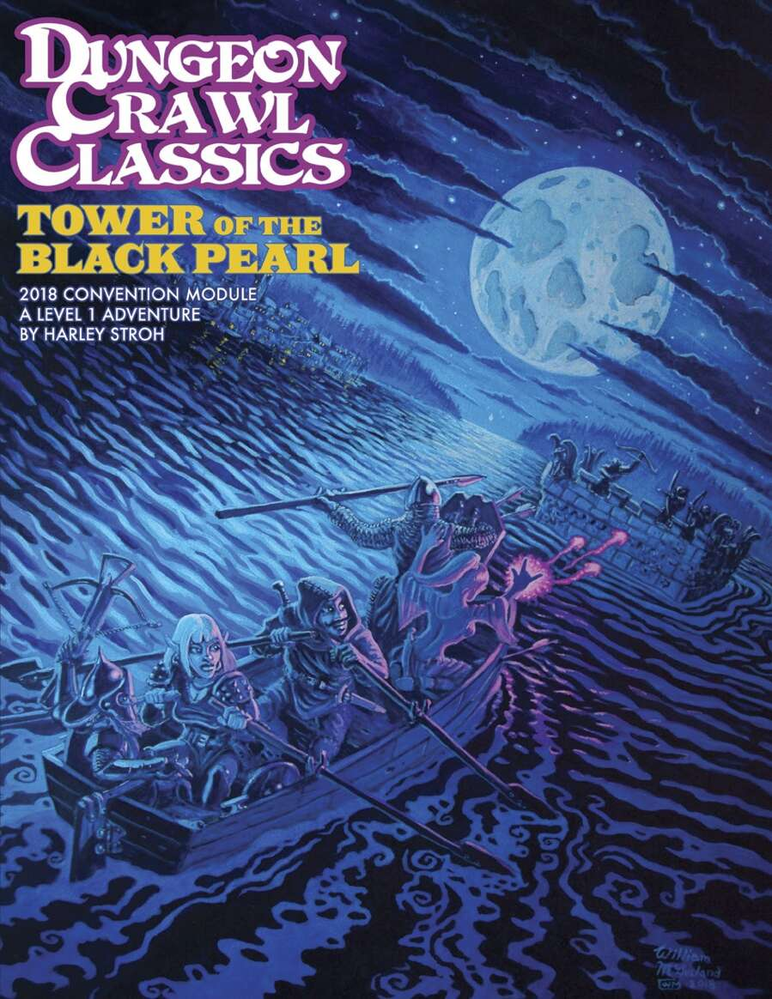

_Spoiler warning: I'm going to talk about Tower of the Black Pearl, an adventure for Dungeon Crawl Classics. If you're part of my group, play DCC with me, and haven't gone into a tower that has risen from the seas, then you should turn away now._

I _love_ running [Dungeon Crawl Classics](https://goodman-games.com/dungeon-crawl-classics-rpg/). It's an absolute joy to run. As a judge, there is a lot of flexibility in the system and you can mix and mash rules from other OSR games or other Goodman Games properties (like [DCC Lankhmar's](https://goodman-games.com/store/product/dungeon-crawl-classics-lankhmar-boxed-set/) [fleeting luck rule](https://talesoftheramblingbumblers.com/2016/10/19/dcc-alternate-luck-healing-rules/)). There's also a **ton** of additional content from fans and publishers like--the [Gongfarmer's Almanac](https://gongfarmersalmanac.com) has 3,220 pages spread across it's volumes from the past 6 years, all for free!

However, it's the adventures that tend to pull people into Dungeon Crawl Classics in the first place. I'm reminded of a number of towers from the various adventures, but one that I fondly remember is the [Tower of the Black Pearl](https://goodman-games.com/store/product/dcc-convention-module-2018-the-tower-of-the-black-pearl-pdf/). In my particular game of this, the players had just set sail from a sinking ziggurat created by the death of a chaos lord and the sinking caused an enormous wave to send the players west.

Once they found a suitable town to dock in and find an inn to stay at, a merchant approaches them and tells them of a tower that rises once every decade from the sea. Within that tower is a black pearl he wants and he's willing to pay 25GP per player (keep in mind that treasure amounts in DCC are far lower than in B/X). It turns out the the tower was built by a wizard of incredible power and the black pearl is pretty much going to bring doom to anyone who possesses it, _but_ you can't blame a guy for trying.

All of that is fun and flavorful, but the best part is that the tower will submerge in 8 hours or--more likely--whenever you say it will. This creates a _fantastic_ escape sequence as players swim up the tower trying not to get caught while grabbing as much loot as they can. I **love** the tension created by a lack of time and the agony over risking it or just getting out. It creates immediacy and verisimilitude, and those things make an adventure fun.
