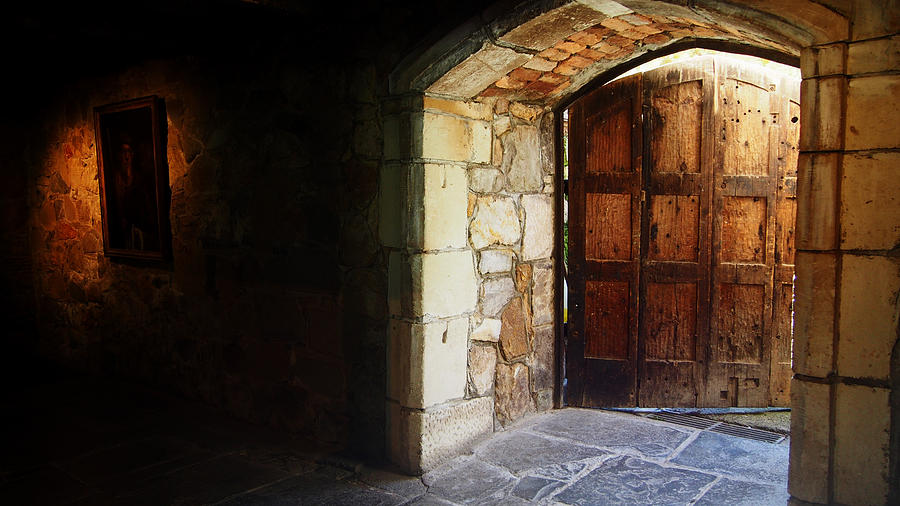

The most common form of a _portal_ that your players will experience is a door. A door by itself is boring, it has a knob and it divides rooms from other rooms and hallways. However, that door breaks up the dungeon into individual segments that can be processed one at a time by the players. The GM may not be so lucky if the players are making a lot of noise, they'll need to keep track if whatever is on the other side is aware of the players.

When interacting with doors you have to think about a few things. First, material:

1. Wooden doors are the typical kind of door. They can swell in a dank dungeon and can be chopped down given enough time. Also, they can be used as a shield or a raft in a pinch.
2. Stone doors are uncommon, but show up in dungeons here or there, usually with a carving that fits the motif of the dungeon. They can't be easily chopped down, but can be broken up with the right tools.
3. Metal doors are rare and usually protect something like the dungeon's main treasures. When you find a metal door, you've likely found something good, but good luck breaking it down.

Then, there's how you interact with the door:

1. It's unlocked, just open it up.
2. It's stuck. This is largely used in old-school D&D as a chance to surprise whatever is on the other side if they can bust it down on the first attempt. If they can't open it on the first attempt, they'll get it open, but whatever is on the other side is now aware of them.
3. It's locked, the players need to either find the key, pick the lock, or chop the door down (if they can).
4. It's hidden, maybe as a bookshelf door or a door carved to look like part of the wall. I typically give my players some hint that there's a door here, scrapes on the floor usually.
5. It's trapped, and either damages them directly or triggers a trap or an alarm nearby. I usually telegraph the trap with some visual evidence (e.g. scorch marks, damage on the door).

I tend to find that we tend toward basic unlocked wooden doors, but there are so many more options, use them!
