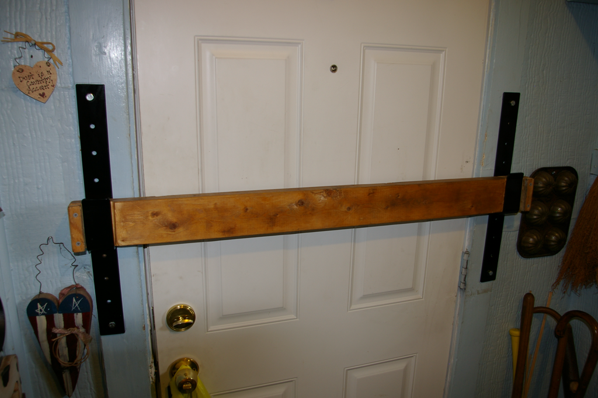

Levers make me think of simple machines: pulleys, wheel and axle, wedges, levers, and so forth. Some _very_ complex problems can be solved with these very tools. Recently in one of my games, players had to remove the bar from a barred door, kinda like this:

Now, there were some exceptions: the door had intricate carvings of snakes, the bar was made of stone (and quite large), and it was trapped. When the player characters picked it up, they heard a clicking noise and quickly put the bar down. After studying it a bit, they noticed that the metal hooks holding the bar were trapped. There are many ways to get past this, but they choose to crate a rough pulley by tying a rope to the bar and running it over the top of a casket which held a clay snake-man statue. They pulled and the bar came up and a hammer came out of the ceiling smashing the casket, _but not the players_.

That's a roundabout story to basically say: allow and encourage your players to solve problems using something like a lever, something simple and something that you can reason about easily. Create problems that can be solved with those tools.
