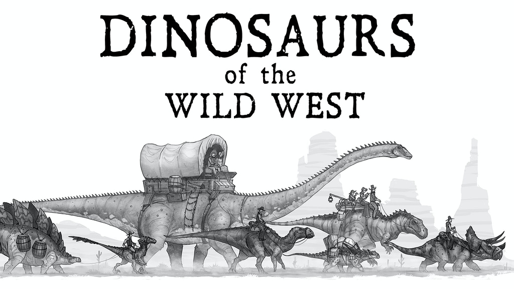

I love a good vanilla fantasy dungeon, with enemies you expect and an ending you can hope for. However, I also appreciate when things get strange, _though_ typically not with horror elements, they don't do much for me. What I do like is _gonzo_. As defined by Merriam-Webster:

> outlandishly unconventional, outrageous, or extreme

So instead of finding the Jade Scimitar of Vyalna, you find a laser rifle that may or may not work, who knows? Instead of fighting goblins, you're fighting cavemen or something in a space suit, or maybe aliens or dinosaurs. All of those are possible when it comes to gonzo. The best part as far as I'm concerned is there is no _real_ limit when it comes to gonzo. If you want to mix in laser swords, dinosaur mounts, and space ships that can totally work! Or maybe you prefer your dinosaurs in the Wild West?

